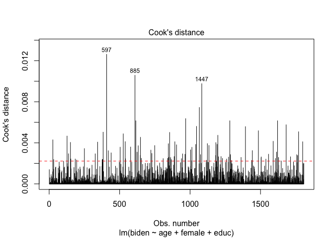
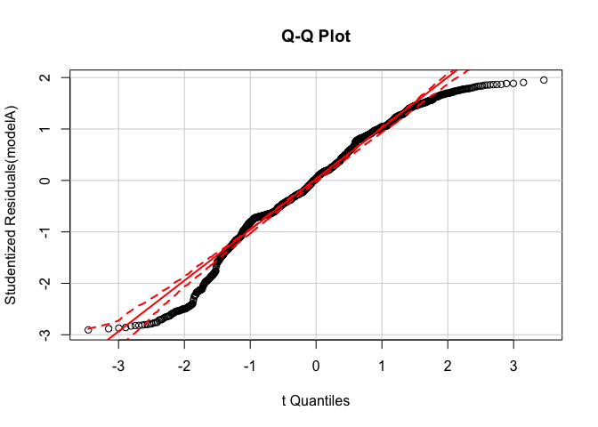
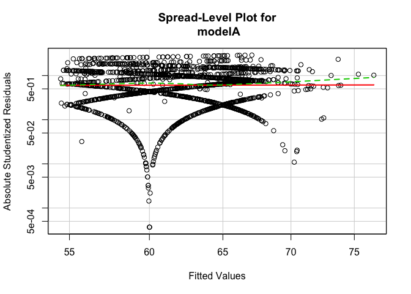

PS3
================
Wanlin Ji
5/15/2017

``` r
rm(list = ls())
setwd('/Users/jiwanlin/Desktop/MACS30200proj/ProblemSets')
dat <- read.csv('biden.csv')
datAB <- na.omit(dat) 
```

Regression diagnostics (5 pts)
==============================

1.Test the model to identify any unusual and/or influential observations.
-------------------------------------------------------------------------

``` r
modelA <- lm(biden ~ age + female + educ, data = datAB)
summary(modelA)
```

    ## 
    ## Call:
    ## lm(formula = biden ~ age + female + educ, data = datAB)
    ## 
    ## Residuals:
    ##     Min      1Q  Median      3Q     Max 
    ## -67.084 -14.662   0.703  18.847  45.105 
    ## 
    ## Coefficients:
    ##             Estimate Std. Error t value Pr(>|t|)    
    ## (Intercept) 68.62101    3.59600  19.083  < 2e-16 ***
    ## age          0.04188    0.03249   1.289    0.198    
    ## female       6.19607    1.09670   5.650 1.86e-08 ***
    ## educ        -0.88871    0.22469  -3.955 7.94e-05 ***
    ## ---
    ## Signif. codes:  0 '***' 0.001 '**' 0.01 '*' 0.05 '.' 0.1 ' ' 1
    ## 
    ## Residual standard error: 23.16 on 1803 degrees of freedom
    ## Multiple R-squared:  0.02723,    Adjusted R-squared:  0.02561 
    ## F-statistic: 16.82 on 3 and 1803 DF,  p-value: 8.876e-11

Assessing outliers
==================

``` r
library(car)
outlierTest(modelA)
```

    ## 
    ## No Studentized residuals with Bonferonni p < 0.05
    ## Largest |rstudent|:
    ##     rstudent unadjusted p-value Bonferonni p
    ## 34 -2.905524          0.0037111           NA

This functin only judges whether there is outliers by the significance level of residual. If not significant, it tells me that there is no outliers in the data; if significant, then we must look into the reason for this outlier and examine whether there are other significant outliers existing. The result showed that Point 34 is diagnosed as outlier(p = 0.003), if we can be sure according to the original material that this point is due to an error, we can delete this point and use other cases for further analysis.

Cook's D Plot
=============

identify D values &gt; 4/(n-k-1)
================================

``` r
cutoff <- 4/(nrow(datAB) - length(modelA$coefficients) - 2)
plot(modelA, which = 4, cook.levels = cutoff)
abline(h = cutoff, lty = 2, col = "red")
```



Cook's D can detect whether there is influencial point, which would cause large influence to the model when removing it. From the Cook's D test, an influencial point is when D is larger than 4/(n-k-1). n stands for size of the sample and k is the number of predictive variables. From the graph, we can find that Point 597, 885, and 1447 belongs to influencial points. Removing these three points would cause huge difference to the model predictions.

Firstly, we can removing them individually and observe the difference, then we look into the original data collection materials to find the reason for the influencial points. We are free to delete these points if they are due to error. But in other circumstances, we may need to remove the data point to see if there is any influence, produce the figure for comparing coefficient changes with/without outliers and report in the footnote.

2.Test for non-normally distributed errors.
===========================================

Assessing normality
===================

``` r
qqPlot(modelA, labels = FALSE, simulate = TRUE, main = "Q-Q Plot")
```



We can find the central part of points are in the 95 percent confidence interval that fits the normal distribution assumption and we can also find that the points in the edge are not satisfying the assumption and shows the shape quite like the uniform distribution. We need to inspect the reason for producing these y values in out data. Again, if it belongs to error we should delete them, or keep them and leave an explanation.

3.Test for heteroscedasticity in the model.
===========================================

Assessing homoscedasticity
==========================

``` r
ncvTest(modelA)
```

    ## Non-constant Variance Score Test 
    ## Variance formula: ~ fitted.values 
    ## Chisquare = 3.971476    Df = 1     p = 0.04627718

``` r
spreadLevelPlot(modelA)
```



    ## 
    ## Suggested power transformation:  0.9305313

Suggested power transformation: 0.9305313

From the result we can find that the the significance level is 0.046, which is marginal significance and satisfies the assumption. From the graph, we can find that the graph is roughly aroung the horizontal line, but some points are far away from the horizontal curves.

4.Test for multicollinearity.
=============================

``` r
vif(modelA)
```

    ##      age   female     educ 
    ## 1.013369 1.001676 1.012275

``` r
sqrt(vif(modelA)) > 2
```

    ##    age female   educ 
    ##  FALSE  FALSE  FALSE

From the result we find there is no multicollinearity with these three variables.

Interaction terms (5 pts)
=========================

``` r
modelB <- lm(biden ~ age + educ + age:educ, data = datAB)
summary(modelB)
```

    ## 
    ## Call:
    ## lm(formula = biden ~ age + educ + age:educ, data = datAB)
    ## 
    ## Residuals:
    ##     Min      1Q  Median      3Q     Max 
    ## -70.539 -12.244  -0.936  20.502  44.737 
    ## 
    ## Coefficients:
    ##             Estimate Std. Error t value Pr(>|t|)    
    ## (Intercept) 38.37351    9.56357   4.012 6.25e-05 ***
    ## age          0.67187    0.17049   3.941 8.43e-05 ***
    ## educ         1.65743    0.71399   2.321 0.020379 *  
    ## age:educ    -0.04803    0.01290  -3.723 0.000203 ***
    ## ---
    ## Signif. codes:  0 '***' 0.001 '**' 0.01 '*' 0.05 '.' 0.1 ' ' 1
    ## 
    ## Residual standard error: 23.27 on 1803 degrees of freedom
    ## Multiple R-squared:  0.01756,    Adjusted R-squared:  0.01592 
    ## F-statistic: 10.74 on 3 and 1803 DF,  p-value: 5.368e-07

1.effect of age on Joe Biden thermometer rating, conditional on education.
==========================================================================

From the result, age has the significant positive influence to the Joe Biden thermometer, the coefficient is 0.67 (p &lt; 0.001), and its interaction term with education is negative. When the ages is larger, the education has less positive influence, the interaction term coefficient is -0.05 (p&lt;0.001).

2.effect of education on Joe Biden thermometer rating, conditional on age.
==========================================================================

Education has a significant level of influence to Joe Biden thermometer, the influence is positive with an coefficient is 1.65 (p&lt;0.001), the education decrease the influence that age may have on the thermometer, the interaction term is -0.05 (p&lt;0.001).

Missing data (5 pts)
====================

multiple imputation
===================

``` r
library(mice)
imp <- mice(dat, seed = 1234)
```

    ## 
    ##  iter imp variable
    ##   1   1  biden  age  educ  dem  rep
    ##   1   2  biden  age  educ  dem  rep
    ##   1   3  biden  age  educ  dem  rep
    ##   1   4  biden  age  educ  dem  rep
    ##   1   5  biden  age  educ  dem  rep
    ##   2   1  biden  age  educ  dem  rep
    ##   2   2  biden  age  educ  dem  rep
    ##   2   3  biden  age  educ  dem  rep
    ##   2   4  biden  age  educ  dem  rep
    ##   2   5  biden  age  educ  dem  rep
    ##   3   1  biden  age  educ  dem  rep
    ##   3   2  biden  age  educ  dem  rep
    ##   3   3  biden  age  educ  dem  rep
    ##   3   4  biden  age  educ  dem  rep
    ##   3   5  biden  age  educ  dem  rep
    ##   4   1  biden  age  educ  dem  rep
    ##   4   2  biden  age  educ  dem  rep
    ##   4   3  biden  age  educ  dem  rep
    ##   4   4  biden  age  educ  dem  rep
    ##   4   5  biden  age  educ  dem  rep
    ##   5   1  biden  age  educ  dem  rep
    ##   5   2  biden  age  educ  dem  rep
    ##   5   3  biden  age  educ  dem  rep
    ##   5   4  biden  age  educ  dem  rep
    ##   5   5  biden  age  educ  dem  rep

``` r
modelC <- with(imp, lm(biden ~ age + female + educ))
pooled <- pool(modelC)
summary(pooled)
```

    ##                     est         se         t        df     Pr(>|t|)
    ## (Intercept) 65.32918523 3.30467000 19.768747 125.09136 0.000000e+00
    ## age          0.05013536 0.03512001  1.427544  28.91485 1.641347e-01
    ## female       5.44470357 1.00116109  5.438389 762.05521 7.246811e-08
    ## educ        -0.65218244 0.20681161 -3.153510 110.28736 2.078640e-03
    ##                   lo 95      hi 95 nmis        fmi     lambda
    ## (Intercept) 58.78887985 71.8694906   NA 0.18579999 0.17288554
    ## age         -0.02170231  0.1219730   46 0.40783530 0.36824528
    ## female       3.47934242  7.4100647    0 0.06090319 0.05844177
    ## educ        -1.06202263 -0.2423422   11 0.19919205 0.18480033

``` r
imp
```

    ## Multiply imputed data set
    ## Call:
    ## mice(data = dat, seed = 1234)
    ## Number of multiple imputations:  5
    ## Missing cells per column:
    ##  biden female    age   educ    dem    rep 
    ##    460      0     46     11     33     33 
    ## Imputation methods:
    ##  biden female    age   educ    dem    rep 
    ##  "pmm"     ""  "pmm"  "pmm"  "pmm"  "pmm" 
    ## VisitSequence:
    ## biden   age  educ   dem   rep 
    ##     1     3     4     5     6 
    ## PredictorMatrix:
    ##        biden female age educ dem rep
    ## biden      0      1   1    1   1   1
    ## female     0      0   0    0   0   0
    ## age        1      1   0    1   1   1
    ## educ       1      1   1    0   1   1
    ## dem        1      1   1    1   0   1
    ## rep        1      1   1    1   1   0
    ## Random generator seed value:  1234

``` r
datP <- complete(imp, action=3)
head(dat)
```

    ##   biden female age educ dem rep
    ## 1    90      0  19   12   1   0
    ## 2    70      1  51   14   1   0
    ## 3    60      0  27   14   0   0
    ## 4    50      1  43   14   1   0
    ## 5    60      1  38   14   0   1
    ## 6    85      1  27   16   1   0

The result after imputation shows that the intercept is 65.32 (p&lt;0.001), age has the influencial coefficient 0.05 (p&lt;0.001) to the thermometer with significance. The gender also has a significant influence with coefficient 5.44 (p&lt;0.001). The education has a a significant influence with coefficient -0.65 (p&lt;0.001).

For the non-imputed model, the intercept is 68.62 (p&lt;0.001). Age does not have a significant influence on the model with coefficient 0.04 (p=0.2). Gender has a significant level of influence with coefficient -0.88(p&lt;0.001). Generally, the direction of coefficient did not changed after imputation, but the coefficient did change slightly due to that deleting the missing value decrease the observations. And it also effect the significant level. The age is significant after imputation but for the non-imputed model the age is not significant. The standard errors also changed slightly.
